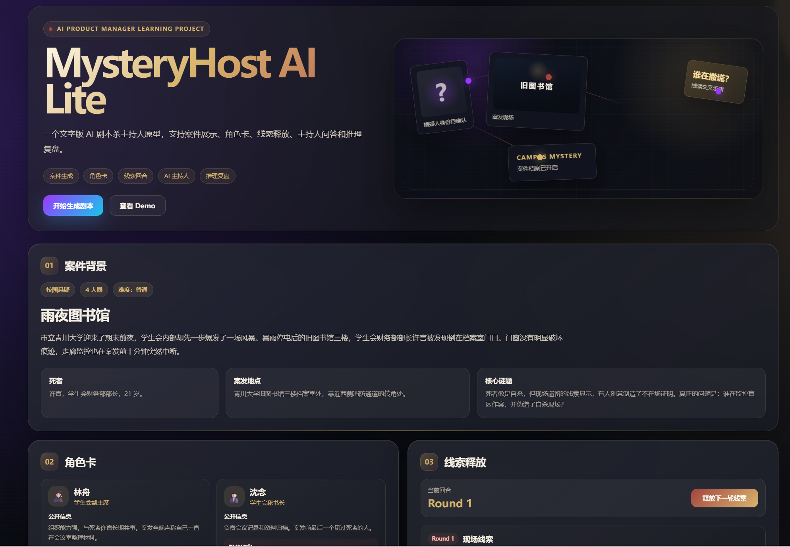

# MysteryHost AI Lite

## 在线访问

- GitHub 仓库：https://github.com/yuuu956/mysteryhost-ai-lite
- 在线 Demo：https://yuuu956.github.io/mysteryhost-ai-lite/

## 项目截图




MysteryHost AI Lite 是一个文字版 AI 剧本杀主持人原型项目。

本项目用于探索 AI 如何在互动推理游戏中扮演主持人角色，完成案件背景展示、角色分配、线索释放、玩家提问回应和最终推理复盘。

本项目同时也是我的 AI 产品经理学习作品集。我在实现项目的过程中，系统学习并整理 AI 产品经理需要掌握的核心能力，包括 LLM、Prompt Engineering、Structured Output、Memory、Agent Workflow、Tool Use、AI Evaluation 和 Risk Control。

---

## 1. 项目简介

MysteryHost AI Lite 是一个文字版 AI 剧本杀主持人 Demo。

它模拟剧本杀主持人的核心职责，包括：

* 展示案件背景
* 分配角色卡
* 按回合释放线索
* 回答玩家问题
* 防止提前剧透
* 分析玩家最终推理
* 生成推理复盘结果

当前 MVP 版本使用本地 mock 数据和规则逻辑模拟 AI 能力。后续版本可以进一步接入 LLM API、结构化 Prompt 和 Agent 工作流。

---

## 2. 为什么做这个项目？

本项目的目标不是单纯做一个“故事生成器”，而是通过一个可运行的 AI 产品原型，学习 AI 产品经理的核心能力。

学习路径如下：

```text
AI 概念学习
→ 产品经理视角理解
→ 功能设计
→ Demo 实现
→ GitHub 文档沉淀
→ 面试项目表达
```

MysteryHost AI Lite 的重点不是让 AI 随机生成悬疑故事，而是探索：

> AI 如何在一个有规则、有阶段、有信息权限、有风险控制的互动产品中承担功能型角色。

---

## 3. MVP 核心功能

当前版本已经实现以下功能：

| 功能模块    | 功能说明                             |
| ------- | -------------------------------- |
| 案件背景展示  | 展示案件标题、主题、死者信息、案发地点和核心谜题         |
| 角色卡展示   | 展示角色身份、公开信息、隐藏秘密、人物关系和可疑点        |
| 分轮线索释放  | 按 Round 1、Round 2、Round 3 逐步释放线索 |
| 主持人问答   | 玩家可以向主持人提问，系统会基于当前信息进行不剧透回应      |
| 推理复盘    | 玩家提交最终推理后，系统输出评分、遗漏点和最终真相        |
| 暗黑悬疑风界面 | 使用深色 Dashboard 风格呈现推理体验          |

---

## 4. AI 能力映射

| AI 能力              | 当前 MVP 实现方式   | 后续升级方向                 |
| ------------------ | ------------- | ---------------------- |
| LLM                | 使用本地规则模拟      | 接入 LLM API，实现动态生成      |
| Prompt Engineering | 已整理 Prompt 模板 | 用于真实 API 调用            |
| Structured Output  | 使用本地结构化 JS 数据 | 要求 LLM 输出 JSON         |
| Memory             | React 状态和聊天记录 | 构建完整 gameState         |
| Agent Workflow     | 使用手动状态流程模拟    | 增加主持人 Agent Controller |
| Tool Use           | 使用本地函数模拟工具    | 实现工具调用式工作流             |
| Risk Control       | 使用规则防剧透       | 增加输出校验和剧透检查            |
| Evaluation         | 已设计评测指标和测试用例  | 后续增加自动化测试              |

---

## 5. 产品体验流程

```text
用户进入页面
→ 阅读案件背景
→ 查看角色卡
→ 查看第一轮线索
→ 向 AI 主持人提问
→ 释放更多线索
→ 提交最终推理
→ 获得推理评分、遗漏点和最终真相
```

---

## 6. 技术栈

* React
* Vite
* JavaScript
* 本地 JS mock 数据
* Markdown 项目文档
* GitHub 作品集结构

---

## 7. 项目结构

```text
mysteryhost-ai-lite/
├── docs/
│   ├── learning-roadmap.md
│   ├── product-requirements.md
│   ├── prompt-design.md
│   ├── state-design.md
│   ├── agent-workflow.md
│   ├── evaluation-metrics.md
│   └── risk-control.md
│
├── learning-notes/
│   ├── 01-ai-product-manager-basics.md
│   ├── 02-llm-basics.md
│   ├── 03-prompt-engineering.md
│   ├── 04-structured-output.md
│   ├── 05-memory-and-state-management.md
│   ├── 06-agent-and-tool-use.md
│   └── 07-ai-evaluation-and-risk-control.md
│
├── src/
│   ├── data/
│   │   └── mysteryCase.js
│   ├── prompts/
│   │   ├── host-prompt.md
│   │   ├── review-prompt.md
│   │   └── script-generation-prompt.md
│   ├── App.jsx
│   ├── App.css
│   └── index.css
│
└── README.md
```

---

## 8. 项目文档

### 产品与 AI 设计文档

| 文档                                       | 内容说明                         |
| ---------------------------------------- | ---------------------------- |
| [学习路线](./docs/learning-roadmap.md)       | 记录本项目对应的 AI 产品经理学习路径         |
| [产品需求文档](./docs/product-requirements.md) | 记录产品定位、用户场景、MVP 范围和版本规划      |
| [Prompt 设计文档](./docs/prompt-design.md)   | 记录剧本生成、主持人问答、推理复盘的 Prompt 设计 |
| [状态管理设计](./docs/state-design.md)         | 记录游戏状态、上下文记忆和防剧透状态控制         |
| [Agent 工作流设计](./docs/agent-workflow.md)  | 记录主持人 Agent、工具调用和工作流设计       |
| [AI 评测指标](./docs/evaluation-metrics.md)  | 记录 AI 输出质量、产品体验和测试用例         |
| [风险控制文档](./docs/risk-control.md)         | 记录防剧透、防幻觉、流程控制和格式校验策略        |

### AI 产品经理学习笔记

| 学习笔记                                                                                       | 主题                               |
| ------------------------------------------------------------------------------------------ | -------------------------------- |
| [01 AI 产品经理基础](./learning-notes/01-ai-product-manager-basics.md)                           | AI 产品经理职责、能力模型和产品思维              |
| [02 LLM 基础](./learning-notes/02-llm-basics.md)                                             | LLM、Token、Context Window、幻觉和模型边界 |
| [03 Prompt Engineering](./learning-notes/03-prompt-engineering.md)                         | 角色、任务、上下文、约束和输出格式                |
| [04 Structured Output](./learning-notes/04-structured-output.md)                           | JSON、卡片渲染、字段校验和前端映射              |
| [05 Memory and State Management](./learning-notes/05-memory-and-state-management.md)       | 游戏状态、短期记忆和上下文控制                  |
| [06 Agent and Tool Use](./learning-notes/06-agent-and-tool-use.md)                         | Agent 工作流、Function Calling 和模拟工具 |
| [07 AI Evaluation and Risk Control](./learning-notes/07-ai-evaluation-and-risk-control.md) | AI 评测指标、幻觉控制和防剧透机制               |

---

## 9. 当前版本

### V0.2 DeepSeek API Integration

当前版本已经在 V0.1 静态交互 MVP 基础上，新增真实 LLM API 调用能力。

已完成：

* React + Vite 项目初始化
* 暗黑悬疑风 Dashboard 页面
* 案件背景渲染
* 角色卡渲染
* 分轮线索释放
* 本地规则版主持人问答
* 本地规则版推理复盘
* 本地 Express 后端服务
* DeepSeek API 接入
* `/api/health` 后端健康检查接口
* `/api/host-chat` AI 主持人问答接口
* 前端主持人问答模块调用后端 API
* API 调用失败时自动回退到本地规则回答
* `.env.example` 环境变量示例文件
* `.gitignore` 保护真实 `.env`
* GitHub Pages 在线部署
* v0.1.0 和 v0.2.0 GitHub Release

说明：

GitHub Pages 是静态部署环境，不包含本地 Express 后端。因此线上 Demo 可以正常展示页面，并在无法连接本地后端时使用 fallback 兜底逻辑。

如果要体验真实 DeepSeek AI 主持人，需要在本地同时运行：

```powershell
npm.cmd run server
npm.cmd run dev
```
---

## 10. 后续规划

### V0.3 Agent 工作流版

* 增加 Host Agent Controller
* 将本地函数拆分为工具模块
* 增加防剧透检查工具
* 增加线索一致性检查工具
* 增加 gameState 构建器

### V0.4 多模态扩展版

* 增加角色头像
* 增加案件封面图
* 增加语音主持人
* 增加可分享推理报告

---

## 11. 作品集价值

本项目展示了以下 AI 产品经理能力：

* AI 产品定位
* 用户场景设计
* MVP 功能优先级判断
* Prompt 设计
* 结构化输出设计
* 状态管理和上下文控制
* Agent 工作流思维
* AI 评测指标设计
* 风险控制策略
* GitHub 项目文档沉淀

本项目的核心学习结论是：

> AI 产品不是简单接入一个大模型，而是需要明确的场景、结构化输入输出、状态管理、流程设计、评测体系和风险控制，才能形成真正可用的产品体验。
